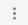

## Проєкт БО “БФ Чиста вода всім”

# Інструкція з використання адмін-панелі

#### Зміст

1. [Загальні положення](#загальні-положення)
2. [Важлива інформація](#важлива-інформація)
3. [Вхід в систему](#вхід-в-систему)
4. [Опис основних функцій](#опис-основних-функцій)
   - [Команди головного меню](#команди-головного-меню)
5. [Робота з бібліотекою медіа (зображення)](#робота-з-бібліотекою-медіа-зображення)
   - [Вхід до бібліотеки медіа](#вхід-до-бібліотеки-медіа)
   - [Організація структури сховища](#організація-структури-сховища)
   - [Додавання зображень до бібліотеки](#додавання-зображень-до-бібліотеки)
   - [Редагування та видалення зображень](#редагування-та-видалення-зображень)
6. [Опис функціоналу адмін-панелі](#опис-функціоналу-адмін-панелі)
   - [Зміна контенту оголошення в розділі сайту Актуальний збір](#зміна-контенту-оголошення-в-розділі-сайту-актуальний-збір)
   - [Керування картками в розділі сайту Проєкти](#керування-картками-в-розділі-сайту-проєкти)
   - [Створення нової картки проєкту](#створення-нової-картки-проєкту)
   - [Редагування проєктів в списку](#редагування-проєктів-в-списку)
7. [Надсилання оновленої інформації на сайт](#надсилання-оновленої-інформації-на-сайт)

## Загальні положення

Документ описує інтерфейс керування і основні дії користувача адміністративної
панелі управління сайтом “БФ Чиста вода всім”.

Адмін-панель дозволяє оперативно змінювати (редагувати, додавати, видаляти)
наступний контент на сайті без внесення змін до коду:

| Розділ          | Що можемо                                                |
| --------------- | -------------------------------------------------------- |
| Актуальний збір | - Змінити контент текстового блоку з оголошенням         |
| Проєкти         | - Додати / видалити картку проєкту                       |
|                 | - Редагувати існуючу картку проєкту                      |
|                 | - Додавати, змінювати або видаляти фото з картки проєкту |

## Важлива інформація

⚠️Робота в розділах застосунку, не описаних в цій інструкції, може спричинити
некоректну роботу сайту “БФ Чиста вода всім” або невідповідне відображення
інформації на сайті .

## Вхід в систему

1. Перейти за посиланням https://pure-water.admin.datocms.com/
2. У вікні Log In ввести логін та пароль користувача

3. Клікнути на кнопку Login

---

_Дані для входу в систему користувач мусить отримати від розробників
адмін-панелі._ _Для повноцінного користування адмін-панеллю у користувача в
наявності мають бути дані для двох облікових записів:_

- _Логін / пароль для входу в адмін-панель_
- _Логін / пароль для входу в обліковий запис на cloudinary.com для роботи з
  медіа-бібліотекою адмін-панелі_

---

## Опис основних функцій

Головна сторінка адмін-панелі виглядає наступним чином:

Центральна частина сторінки - вікно відображення, контент в якому залежить від
обраної секції. Верхній рядок - це головне меню додатку. Ліва частина сторінки
являє собою блок підменю для відповідного пункту головного меню.

### Команди головного меню

Іконка з написом у верхньому лівому кутку при кліку відкриває в окремій вкладці
браузера сайт БФ “Чиста вода всім”.

Пункт головного меню **Content** відкриває доступ до функціоналу адмін-панелі. У
документі описані такі функції адмін-панелі:

- **Fundraising** - доступ до контенту блоку з оголошеннями секції Актуальний
  збір сайту
- **Projects** - доступ до редагування карток проєктів на сайті

Пункт головного меню **Media** дає можливість працювати з внутрішньою
медіа-бібліотекою додатку. В поточній версії адмін-панелі тут зберігається
зображення іконки сайту. Для адміністратора сайту не передбачено яких-небудь дій
в цьому пункті.

Пункт головного меню **Settings** відкриває доступ до системних налаштувань
додатку. Для адміністратора сайту не передбачено яких-небудь дій в цьому пункті.

Іконка пошуку дозволяє робити пошук інформації в додатку.

Пункт меню Build status дозволяє ініціювати деплой оновленої інформації на сайт,
а також перевіряти статус останнього деплою. Робота з ним описана в окремому
розділі інструкції.

Пункт меню з ініціалами користувача у верхньому правому кутку відкриває меню
користувача:

За допомогою цього меню користувач може:

- налаштувати мову відображення, формат дати і часу і часову зону -
  **Localization settings**
- вийти з облікового запису адмін-панелі (рекомендується для завершення
  роботи) - **Log out**

## Робота з бібліотекою медіа (зображення)

Медіа-бібліотека адмін-панелі призначена для впорядкування і зберігання
зображень (фотографій), що відображаються на картках проєктів в секції сайту
Проєкти.

Медіа-бібліотека адмін-панелі реалізована за допомогою стороннього сервісу
cloudinary.com. При роботі з адмін-панеллю, якщо треба працювати із
зображеннями, медіа-бібліотека мусить бути відкрита в окремій вкладці браузера
одночасно з адмін-панеллю.

### Вхід до бібліотеки медіа

Вхід до медіа-бібліотеки виконується за посиланням https://cloudinary.com/

Для входу до облікового запису необхідно клікнути на **Login** у верхньому
правому кутку сторінки.

Далі у вікні Log in to your account необхідно ввести логін та пароль до
облікового запису у відповідні поля і клікнути на кнопку LOG IN.

Після цього відкривається головне вікно бібліотеки:

Робота з зображеннями ведеться через пункт меню Media Library → Assets:

У вікні відображаються всі зображення, що зберігаються в бібліотеці.

### Організація структури сховища

Для упорядкування зображень в бібліотеці є можливість організовувати ієрархічну
структуру сховища за допомогою папок. Робота з зображеннями в папках ведеться
через пункт меню **Media Library → Folders**:

Всі зображення, які використовуються в картках проєктів на сайті, зберігаються в
папці **clear water website medialibrary**. Подвійний клік на назві папки
відкриває її:

Для використання на сайті реалізований наступний підхід:

- папка **clear water website medialibrary** зберігає всі зображення для всіх
  проєктів
- для кожного окремого проєкту в папці **clear water website medialibrary**
  створюється відповідна папка

---

_Даний підхід не є обов’язковим. Користувач має можливість змінити структуру
збереження зображень на свій розсуд_

---

Для додавання нової папки треба клікнути на іконку :

У вікні **Add folder** необхідно ввести ім’я папки і клікнути на **Save**:

Папка з’являється у сховищі:

При натисканні іконки  поруч з іменем
папки відкривається меню дій для відповідної папки:

Обрану папку можна:

- відкрити (командою або подвійним кліком)
- піддати пошуку
- завантажити на комп'ютер
- розшарити
- видалити (разом із вмістом)

### Додавання зображень до бібліотеки

У вибрану для завантаження папку зображення можна додавати двома способами.

1. За допомогою кнопки **Upload**:

При цьому відкривається вікно для завантаження:

Зображення можна вантажити різними способами:

- з комп’ютера -**My files**
- з Інтернету за посиланням - **Web address**
- з гугл диска - **Google Drive**
- з інших джерел
- перетягуючи файл на вільне поле всередині

2. Просто перетягуючи файл з комп’ютера в поле папки:

Завантажені зображення відображаються в полі папки:

### Редагування та видалення зображень

При наведенні курсора на зображення в верхньому правому кутку зображення
з’являється іконка  додаткових
команд:

За допомогою цих команд зображення можна, зокрема, відредагувати або видалити.

## Опис функціоналу адмін-панелі

Доступ до функцій адмін-панелі для керування контентом на сайті відбувається
через пункт **Content** головного меню:

### Зміна контенту оголошення в розділі сайту Актуальний збір

Функція доступна через пункт **Fundraising** в підменю зліва на екрані.

У вікні редагування присутні:

- дві таби **English** і **Ukrainian** для контенту відповідною мовою:

---

_Для коректного відображення сторінок сайту користувач адмін-панелі повинен
задати контент обома мовами._

---

- поле вводу Title (обов’язкове)

сюди вводиться заголовок оголошення. Довжина заголовку повинна бути від 3 до 100
символів.

- текстовий блок **Description** (обов’язковий)

В нього вводиться текст оголошення. Довжина тексту повинна бути від 3 до 1500
символів. За допомогою кнопок форматування в заголовку блоку введений текст
можна робити напівжирним, створювати списки і додавати посилання.

Після внесення будь-яких змін у вікні редагування стає доступною кнопка **Save**
з правої сторони зверху:

Клік на неї зберігає внесені зміни в БД адмін-панелі.

---

**⚠️Важливо!**

Збереження оновлених даних в БД адмін-панелі не призводить до відображення їх на
сторінках сайту. Для того, щоб оновлені дані стали видимими на сайті, необхідно
виконати процедуру деплою, що описана далі в документі в розділі
[Надсилання оновленої інформації на сайт](#надсилання-оновленої-інформації-на-сайт).

---

### Керування картками в розділі сайту Проєкти

Функція доступна через пункт Projects в підменю зліва на екрані.

У вікні редагування відображаються: дві таби **English** і **Ukrainian** для
проєктів відповідною мовою:

---

_Для коректного відображення сторінок сайту користувач адмін-панелі повинен
задати проєкти для обох мов відображення._

**⚠️Важливо!**

Списки проєктів англійською і українською – це фактично два окремих списки.
Користувач адмін-панелі за бажанням може створити різні переліки проєктів для
кожної з мов відтворення.

---

- список (перелік) проєктів для відповідної мови відтворення:

---

_Для кожної мови відтворення мусить існувати як мінімум один проєкт._ _Для
кожної мови відтворення можна створити максимум 20 проєктів._

---

#### Створення нової картки проєкту

Для створення нового проєкту необхідно клікнути на кнопку **New Project Item**
внизу списку:

Після цього до списку додається новий порожній пункт:

Необхідно розгорнути новий пункт для редагування, клікнувши на ньому:

Далі необхідно послідовно заповнити текстові поля відповідною мовою (всі вони є
обов’язковими):

**Title** - назва проєкту **Description** - опис проєкту **Location** - де був
реалізований проєкт (напр.. місто)

Далі треба відредагувати список зображень:

Для кожного проєкту необхідно задати мінімум 3 зображення, максимум - 10.

Клік на кнопці **Image item** розкриває зображення для редагування:

Для вибору зображення, що було попередньо збережене в медіа-бібліотеці,
необхідно клікнути на кнопку **Choose cloudinary asset**, при цьому
відкривається вікно медіа-бібліотеки:

Клік на пункт меню **Folders** відкриває доступ до структурованого сховища:

Знаходимо папку, що відповідає потрібному проєкту (в нашому прикладі це буде
**clean water website medialibrary / test project**):

Позначаємо зображення, яке бажаємо завантажити, при цьому з’являється додаткова
стрічка з командами. В ній клікаємо на **Add & Close**:

Вікно медіа-бібліотеки закривається, а вибране зображення додається до проєкту:

Далі необхідно ввести альтернативний текст для зображення в полі **Alt**:

Таким же чином до проєкту додаються всі необхідні зображення:

---

_Зображення в списку можна впорядковувати, перетягуючи рядки._ _Зображення можна
видаляти зі списку за допомогою команди **Remove block** з додаткового меню, що
відкривається при кліку на трикрапку
() в кінці рядка._

**⚠️Важливо!**

Перше по порядку зображення в списку буде використано як фото на картці проєкту.
Рекомендовано першим ставити фото в альбомній (landscape) орієнтації зі
співвідношенням сторін 4:3.

---

Створений проєкт необхідно зберегти в БД адмін-панелі, клікнувши на кнопку
**Save** з правої сторони зверху вікна редагування:

#### Редагування проєктів в списку

Проєкти можна впорядковувати (змінювати розташування) в списку, перетягуючи
рядки мишкою.

По кліку на трикрапку в кінці рядка відкривається контекстне меню для обраного
проєкту:

- **Collapse all / Expand all** - згорнути / розгорнути всі блоки (рядки)
  проєктів
- **Move Up / Move Down** - перемістити проєкт на один позицію вгору / вниз
- **Copy block** - скопіювати блок проєкту до буферу обміну
- **Duplicate block** - створити копію блоку в поточному розділі
- **Remove block** - видалити блок (проєкт)
- **New Project Item** - створити новий проєкт

---

_Всі зміни, виконані в списку проєктів або в проєктних блоках, треба зберігати в
БД адмін-панелі кліком на кнопку **Save** ._

---

## Надсилання оновленої інформації на сайт

Процедура оновлення інформації на сайті (деплой) надсилає дані з БД адмін-панелі
безпосередньо на сайт, змінюючи відповідним чином контент на сторінках сайту.

Керування деплоєм відбувається за допомогою кнопки **Build status** у верхньому
правому кутку вікна адмін-панелі. При кліку на неї відкривається меню деплою:

Меню показує дату і час внесення останніх змін до сайту (рядок Last date of
deploy: xxx)

Для виконання деплою використовується кнопка **Build now**. Клік на ній ініціює
відправку даних на сайт:

Після кліку на кнопку внизу екрану зліва з’являється повідомлення, що деплой
розпочато, а вигляд меню деплою змінюється:

В заголовку меню з’являється анімований лоадер, а кнопка **Build now** зникає.
Натомість з’являється посилання _Abort and mark as failed_, яке дає можливість
перервати запит на деплой і позначити його як провальний, якщо щось піде не так.

Зазвичай деплой займає декілька хвилин.

При вдалого завершенні деплою внизу екрану зліва з’являється повідомлення, що
деплой завершено успішно, а меню деплою набуває свого нормального вигляду.

Після вдалого завершення деплою треба відкрити сайт і переконатись, що всі
зміни, які були зроблені в адмін-панелі, відображаються належним чином на
сторінках сайту.

---

**⚠️Важливо!**

Якщо зміни не з’явились на сторінках сайту після успішного деплою, слід очистити
кеш браузера.

---
