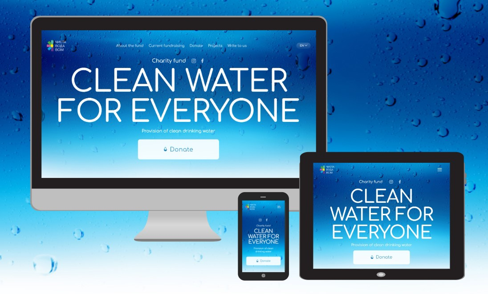
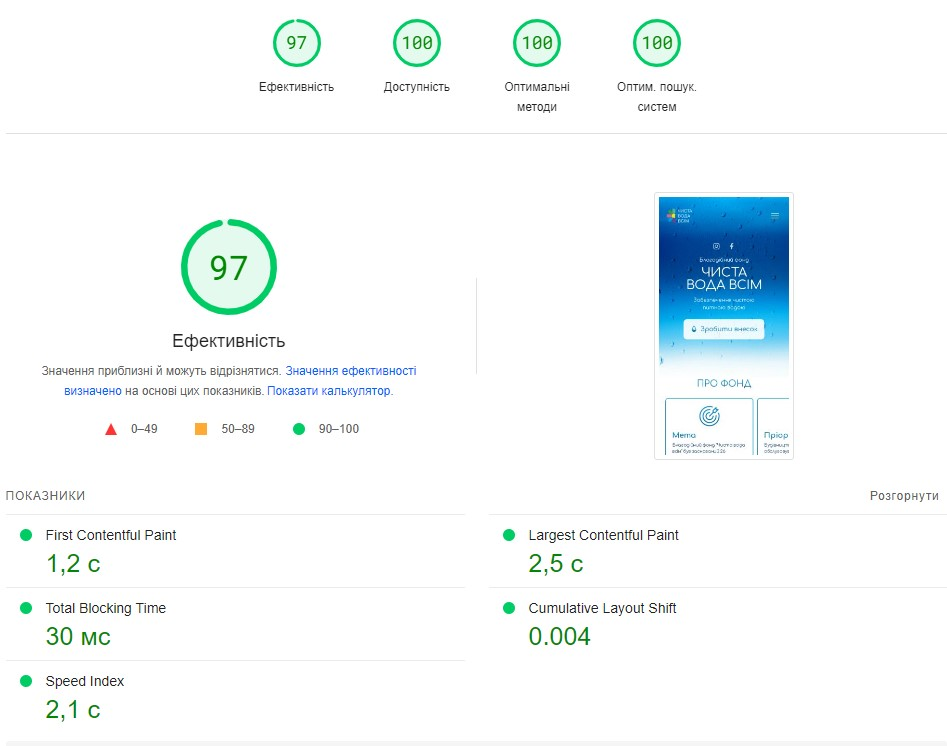

# PURE WATER FOR EVERYONE💧

[Live Page](https://clear-water.vercel.app/uk)

## Project description

Welcome to "Pure Water for Everyone" repository that contains source code and
assets for this website! The "Pure Water for Everyone" is a charity fund that is
focused on providing clean drinking water for everyone, regardless of their
place of residence or social status and raising funds for water purification
systems.

## 📊 Advantages

- Optimization: Website "Pure Water for Everyone" is optimized for fast loading,
  ensuring users can access information quickly.

- Modularity and Reusability: This website is developed using a component-based
  approach, making the code modular and enabling the reuse of components across
  different pages and projects. This simplifies site maintenance and
  functionality expansion.

- Linters and Formatting: The use of tools like Prettier and ESLint helps
  maintain coding standards, ensures a consistent style, and helps identify
  potential issues in the code.

- Responsiveness: The website is highly responsive, enabling the creation of
  dynamic and interactive user interfaces without page reloads. This enhances
  user engagement and interaction.

- Content Management Ease: Сontent management system features an intuitive
  interface, simplifying the process of updating and editing content. You can
  easily make changes to texts, images, and other content without requiring
  specialized web development knowledge.

## 🔍 Accessibility

- Intuitive design
- Semantic HTML
- Mobile-Friendly
- The web resource is available for any device with an Internet connection

## 🛠️ Technologies Used

- Next.js 13
- TailwindCSS
- GraphQL
- Axios
- React Hook Form
- React-scroll
- React responsive
- Headless UI
- Swiper
- Yup
- Copy-to-clipboard
- EsLint
- PropTypes
- DatoCMS (administration panel)

## 🌐 Supported Languages

- Ukrainian
- English

## 🚀 Getting Started

1. Clone the repository: ` https://github.com/SoftRyzen-internship/pure-water`
2. Navigate to the project directory: `cd pure-water`
3. Install all dependencies: `npm install` or `yarn install`
4. Start the project: `npm run dev` or ` yarn dev`
5. Use the project on: `http://localhost:3000`

## Administration Panel

[Administration Panel](https://pure-water.admin.datocms.com/editor)

[📝 Instructions for the site administration panel DatoCMS](./README.admin.md)

The administration panel allows you to quickly change (edit, add, delete) the
content of the Current fundraising and Projects sections on the site without
making changes to the code.
